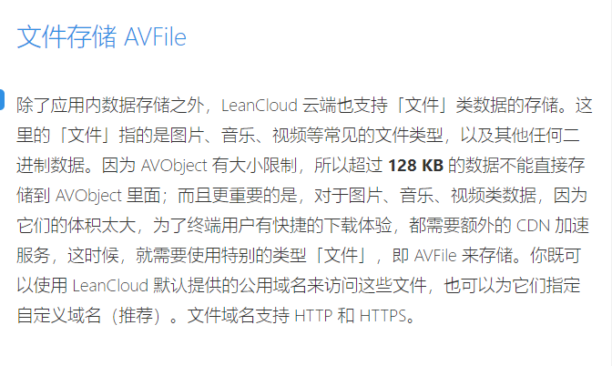
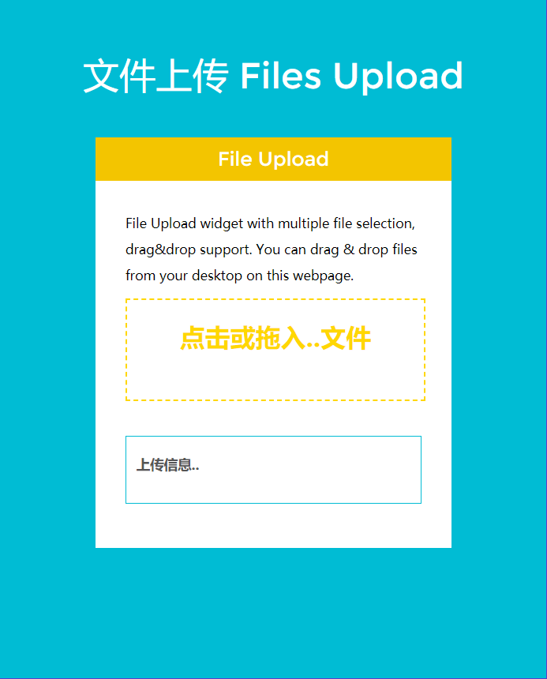
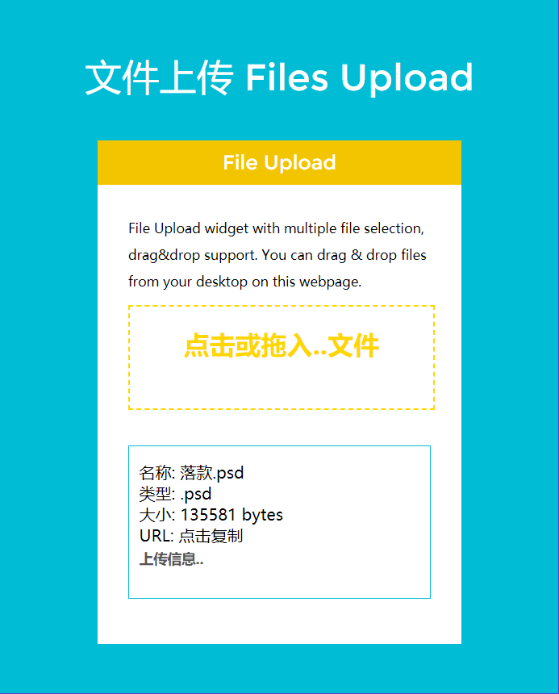
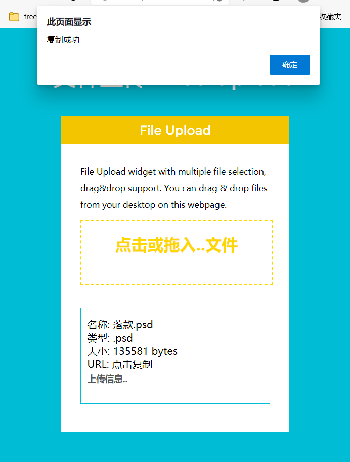

# Files-Upload
> 文件上传系统，借助于 Leancloud 的文件存储实现

之前写的 [fortags](https://github.com/blueweiwei/fortags) 项目是为了存储文字数据，那么，现在的 [Files-Upload](https://github.com/blueweiwei/Files-Upload) 便是为了存储文件信息。

:rose: 没错，Files-Upload 可以存储你的数据！！！

## Introduce

Files-Upload是一个类似于 网盘的服务，依托于Leancloud 文件存储服务。

Leancloud 官方是这样介绍的：

也就是说，结构化数据 单字段最大限制大小为 128KB，因此，对于超过128KB的数据文件，可以考虑使用文件存储。

## How to use

话不多说，先看图。

#### 首页

#### 上传文件

#### 复制链接

点击URL字段，将文件直链复制到剪贴板，CTRL+V 尽享万物魅力。

> PS:采用复制到剪贴板是因为直链太长，采用自定义域名更佳。

演示站点：https://blueweiwei.github.io/Files-Upload

测试站点采用的是共享域名，两个月后不可用，强烈建议绑定自己域名使用。

## Written at the end

仅作技术分享，如欲加入到正式项目中，请自行添加内容审核等功能。

leancloud 分为国内版和国外版，国内板的功能稍多。两个版本均需要身份认证，有意思的是，leancloud认证对接的是支付宝，支付宝内扫脸即可，不需要提供身份证照片。

这个小项目，就当是一个小文件分享而已，和网盘比起来，还有点差距。